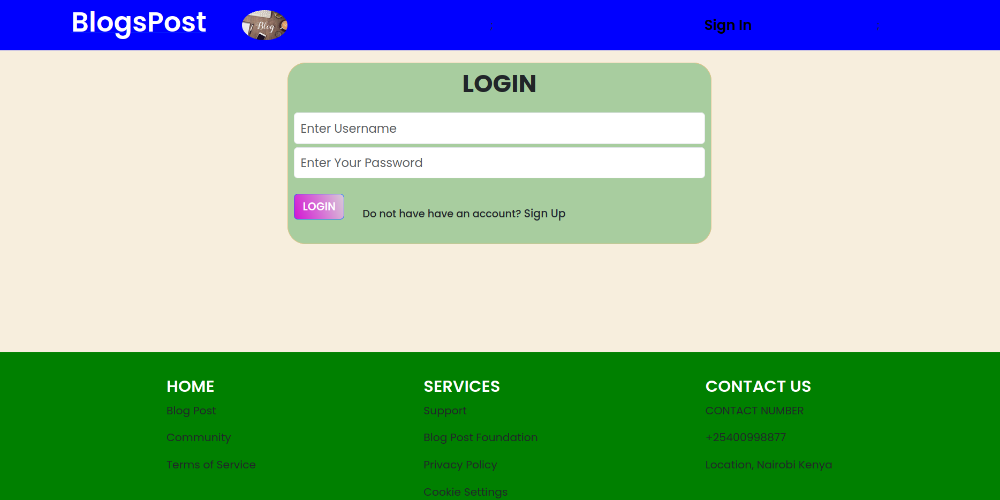
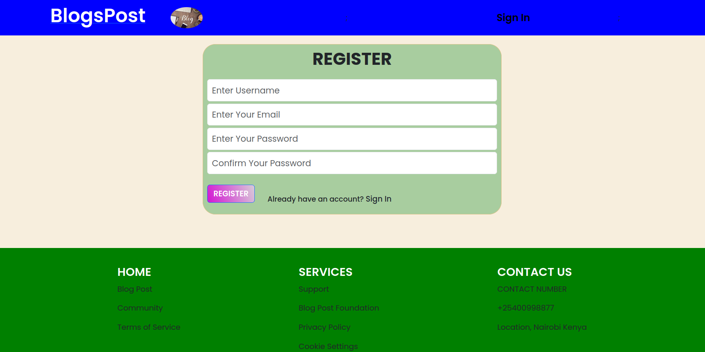
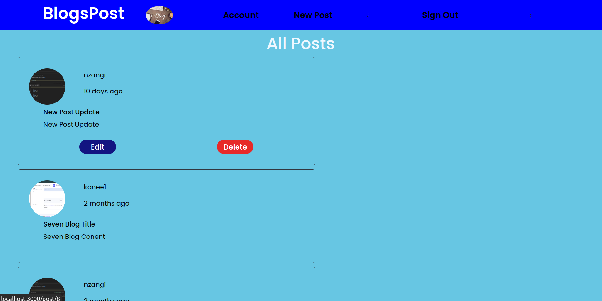
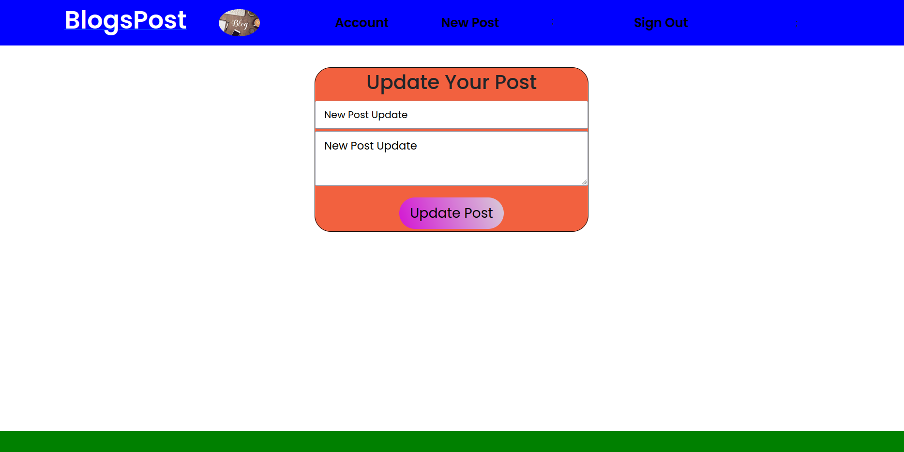

# Django React BlogPost


The Project is made of a backend Using Django Rest Framework and Frontend using React

## How to run the project backend
On the main folder, change directory to backend
Then you can install the requirement on the requirement.txt
Make sure that the server is always running
1. `pip install requirement.txt`
2. `python manage.py runserver`, the server opens at `http://127.0.0.1:8000`

## How to run the project frontend
On the main folder, change directory to frontend
Install the dependencies
1. `npm install`
2. `npm install react-router-dom`
3. `npm install axios`
4. `npm install date-fns`
5. `npm start`, the server opens at `localhost:3000`

Now you can access the frontend and interact with the system


## Project Description : BlogPost Web Application 
The project uses Django Rest Framework for backend,PostgresSQL 
for database and React Js for frontend. The system will enable users to post
,edit their post,delete, comment on other peoples posta and comments.
It gives users a user friendly system where teh users can interact with the system

## Features
- **User Management**: Easily add, update, and delete user post information.
- **Comments**: Easily add, update and delete user comment information.
- **User Authentication**: Registration, Secure login and authentication for users.
- **Database Integration**: Integrated with PostgreSQL for data storage.
- **Role-Based Access Control**: Define roles and permissions according to logged in user.

## Installation 
1. Clone the repository on : $ git clone https://github.com/nzangi/Django-React-BlogPost.git
2. Open the project using your favourite test editor like VS Code or PyCharm.
3. Make sure you are in the BlogPost directory. <br>
4. Configure the PostgreSQL database connection is settings.py (check the Database section for more information). <br>
5. Run the Backend code by navigating to backend folder then
```
python manage.py runserver
```
6. Run the frontend by navigating to frontend folder then
```
npm start
```
7. Check project at `http://localhost:3000`

## Database 

PostgreSQL will be used as the database for this project.<br>
The database connection can be configured in the settings.py file, 
with the appropriate values for the following properties: <br>
```
DATABASES = {
    'default': {
        'ENGINE': 'django.db.backends.postgresql',
        'NAME': 'Your Database Name',
        'USER': 'Your PostgreSQL username',
        'PASSWORD': 'Your PostgreSQL password',
        'HOST': 'localhost',
        'PORT': 'Port Number',
    }
}
```

## Frontend Preview
### The user can register into the system


### After user logs in, he will be able to see this dashboard


### The user can be able to edit only his post



## LICENSE

MIT License

Copyright (c) 2024 Nzangi Muoki

Permission is hereby granted, free of charge, to any person obtaining a copy
of this software and associated documentation files (the "Software"), to deal
in the Software without restriction, including without limitation the rights
to use, copy, modify, merge, publish, distribute, sublicense, and/or sell
copies of the Software, and to permit persons to whom the Software is
furnished to do so, subject to the following conditions:

The above copyright notice and this permission notice shall be included in all
copies or substantial portions of the Software.

THE SOFTWARE IS PROVIDED "AS IS", WITHOUT WARRANTY OF ANY KIND, EXPRESS OR
IMPLIED, INCLUDING BUT NOT LIMITED TO THE WARRANTIES OF MERCHANTABILITY,
FITNESS FOR A PARTICULAR PURPOSE AND NONINFRINGEMENT. IN NO EVENT SHALL THE
AUTHORS OR COPYRIGHT HOLDERS BE LIABLE FOR ANY CLAIM, DAMAGES OR OTHER
LIABILITY, WHETHER IN AN ACTION OF CONTRACT, TORT OR OTHERWISE, ARISING FROM,
OUT OF OR IN CONNECTION WITH THE SOFTWARE OR THE USE OR OTHER DEALINGS IN THE
SOFTWARE.


 